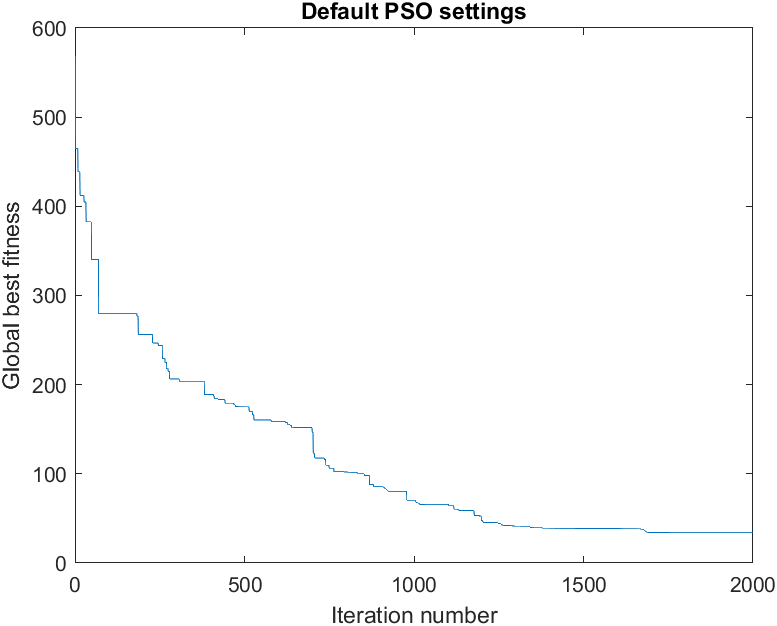
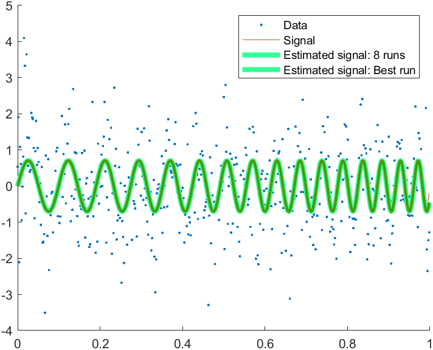
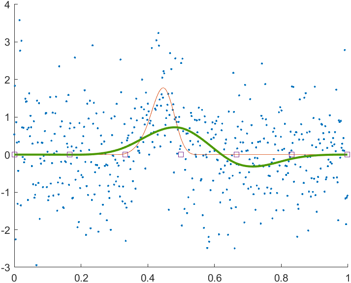

# User Guide for PSO Matlab Code

## Table of Contents
1. [Introduction](#introduction)
2. [Installation and Prerequisites](#installation-and-prerequisites)
3. [Quick Start](#quick-start)
4. [Core Functions](#core-functions)
5. [Test Scripts and Examples](#test-scripts-and-examples)
6. [Creating Custom Fitness Functions](#creating-custom-fitness-functions)
7. [Advanced Usage](#advanced-usage)
8. [Troubleshooting](#troubleshooting)
9. [References](#references)
10. [Additional Resources](#additional-resources)

## Introduction

This repository contains MATLAB implementations of Particle Swarm Optimization (PSO) and some of its applications to illustrative statistical regression problems, namely,

- Quadratic chirp signal regression,
- B-spline regression with PSO-optimized knots,
  
and a benchmark fitness function.

The code was developed for the textbook ["Swarm Intelligence Methods for Statistical Regression"](https://www.amazon.com/Swarm-Intelligence-Methods-Statistical-Regression/dp/0367670372), which was based on courses delivered at the BigDat 2017 (Bari, Italy) and 2019 (Cambridge, UK) international winter schools.

### What is PSO?

Particle Swarm Optimization is a computational method that optimizes a problem by iteratively improving candidate solutions (particles) with regard to a given measure of quality (fitness function) [1]. The particles move through the search space influenced by their own best-known position and the best-known positions of their neighbors.

## Installation and Prerequisites

### Required MATLAB Version
- MATLAB R2016b or later recommended

### Required Toolboxes
The following MATLAB toolboxes are required to run all features of this code:

1. **Curve Fitting Toolbox** - Required for B-spline functions (`bspline`, `fnval`)
   - Used in: `crcbregsplfitfunc.m`, `crcbcrdnlsplfit.m`, `crcbgenbsplsig.m`
   - Not needed if this application is not used or tested.

2. **Parallel Computing Toolbox** (Optional) - For parallel PSO runs
   - Used in: `test_crcbpso_par.m`, `crcbqcpso.m`, `crcbregsplpso.m`
   - If not available, change `parfor` to `for` in these files

### Installation Steps
1. Clone or download this repository
2. Add the `CODES` directory to your MATLAB path:
   ```matlab
   addpath('/path/to/SDMBIGDAT19/CODES');
   ```
3. Verify installation by running:
   ```matlab
   crcbpso()  % Should display default PSO parameters
   ```

## Quick Start

### Running Your First PSO Optimization

This example demonstrates how to run the PSO algorithm on a simple test function (Generalized Rastrigin) using default settings.

```matlab
% Define search space dimensionality
nDim = 5;

% Define fitness function parameters
fitFuncParams = struct('rmin', -5*ones(1,nDim), ...
                       'rmax', 5*ones(1,nDim));

% Create fitness function handle
fitFuncHandle = @(x) crcbpsotestfunc(x, fitFuncParams);

% Run PSO with default settings
psoOut = crcbpso(fitFuncHandle, nDim);

% Display results
disp(['Best fitness: ', num2str(psoOut.bestFitness)]);
disp(['Best location: ', num2str(psoOut.bestLocation)]);
```

## Core Functions

### Naming Conventions
Most functions in this codebase follow the naming pattern `crcb<functionname>.m`, where the prefix "crcb" stands for "CRC book" and refers to the textbook upon which the course is based. Functions without this prefix are borrowed from external libraries and have been ported here to create a self-contained package.

Test scripts with filenames following the pattern `test_crcb<name>.m` reproduce examples from the book and demonstrate how to use the provided functions.

### List of Core Functions
See [CodeList.pdf](docs/CodeList.pdf) for a list of functions with brief documentation.

### 1. `crcbpso` - Main PSO Implementation

**Purpose**: Local-best (lbest) PSO minimizer with ring topology neighborhood [2].

**Design Features**: The PSO code can handle arbitrary dimensionality, customizable parameters, and optional seeding of initial particle locations. It can run on any fitness function that adheres to the specified input/output format (described in [Creating Custom Fitness Functions](#creating-custom-fitness-functions)). This is done by passing a **handle** to the fitness function, which is initialized with all the fitness function parameters embedded. For example,
```matlab
fitFuncHandle = @(x) my_fitness_func(x, fitFuncParams);
```
The PSO code calls the fitness function with **standardized coordinates**, with values in [0,1], of particle locations in the search space. The fitness function handles the conversion to **real coordinates** using helper functions `s2rv` and `r2sv` and the search ranges specified in the `rmax` and `rmin` fields of the fitness function's parameter structure.

**Syntax**:
```matlab
returnData = crcbpso(fitfuncHandle, nDim)
returnData = crcbpso(fitfuncHandle, nDim, psoParams)
returnData = crcbpso(fitfuncHandle, nDim, psoParams, outputLevel)
returnData = crcbpso(fitfuncHandle, nDim, psoParams, outputLevel, seedMatrix)
```

**Input Arguments**:
- `fitfuncHandle`: Handle to the fitness function to minimize 
- `nDim`: Dimensionality of the search space
- `psoParams` (optional): Structure with PSO parameters (see below)
- `outputLevel` (optional): Controls amount of information returned (0, 1, or 2)
- `seedMatrix` (optional): Matrix to seed initial particle locations

**PSO Parameters** (all optional, defaults shown):
```matlab
psoParams = struct(...
    'popSize', 40,              % Number of particles
    'maxSteps', 2000,           % Number of iterations
    'c1', 2,                    % Cognitive acceleration constant
    'c2', 2,                    % Social acceleration constant
    'maxVelocity', 0.5,         % Maximum velocity per component
    'startInertia', 0.9,        % Initial inertia weight
    'endInertia', 0.4,          % Final inertia weight
    'endInertiaIter', 2000,     % Iteration to reach endInertia
    'boundaryCond', '',         % Boundary condition ('' = invisible wall)
    'nbrhdSz', 3                % Neighborhood size (min 3)
);
```

**Output Structure**:
```matlab
returnData.bestLocation      % Best location found (standardized coordinates)
returnData.bestFitness       % Best fitness value
returnData.totalFuncEvals    % Total fitness function evaluations
returnData.allBestFit        % (outputLevel >= 1) Best fitness per iteration
returnData.allBestLoc        % (outputLevel >= 2) Best location per iteration
```

### 2. `crcbqcpso` - Quadratic Chirp PSO

**Purpose**: Regression of quadratic chirp signals using PSO.

**Syntax**:
```matlab
outResults = crcbqcpso(inParams, psoParams, nRuns)
```

**Input Structure**:
```matlab
inParams = struct(...
    'dataY', dataVector,        % Data time series
    'dataX', timeStamps,        % Time stamps
    'dataXSq', timeStamps.^2,   % Time stamps squared
    'dataXCb', timeStamps.^3,   % Time stamps cubed
    'rmin', [a1min, a2min, a3min], % Minimum parameter values
    'rmax', [a1max, a2max, a3max]  % Maximum parameter values
);
```

**Signal Model**: `s(t) = A*sin(2π(a1*t + a2*t² + a3*t³))`
- PSO optimizes the phase coefficients [a1, a2, a3]
- The fitness function is the negative squared inner product between the normalized signal and data (matched filtering)

**Output Structure**:
```matlab
outResults.allRunsOutput     % Array of results from all runs
outResults.bestRun           % Index of best run
outResults.bestFitness       % Best fitness value
outResults.bestSig           % Best estimated signal
outResults.bestQcCoefs       % Best coefficients [a1, a2, a3]
```

### 3. `crcbregsplpso` - Regression Spline PSO

**Purpose**: B-spline regression with PSO-optimized knot locations.

**Syntax**:
```matlab
outResults = crcbregsplpso(inParams, psoParams, nRuns)
```

**Input Structure**:
```matlab
inParams = struct(...
    'dataX', timeStamps,        % Time stamps
    'dataY', dataVector,        % Data values
    'nBrks', nBreakpoints,      % Number of breakpoints to optimize
    'rmin', 0.0,             % Minimum standardized knot value 
    'rmax', 1.0              % Maximum standardized knot value 
);
```

**Output Structure**:
```matlab
outResults.allRunsOutput     % Array of results from all runs
outResults.bestRun           % Index of best run
outResults.bestFitness       % Best fitness value
outResults.bestSig           % Best estimated signal
outResults.bestBrks          % Best breakpoint locations
```

### 4. `crcbcrdnlsplfit` - Cardinal B-Spline Fit

**Purpose**: Direct B-spline fitting with uniformly spaced interior breakpoints (no PSO).

**Syntax**:
```matlab
outStruct = crcbcrdnlsplfit(dataX, dataY, nIntBrks)
```

**Input Arguments**:
- `dataX`: Time stamps
- `dataY`: Data values
- `nIntBrks`: Number of uniformly spaced interior breakpoints

**Output Structure**:
```matlab
outStruct.estSig       % Estimated signal
outStruct.fitVal       % Fitness value (norm of residual)
outStruct.brkPts       % Breakpoint locations
outStruct.bsplCoefs    % B-spline coefficients
```

## Test Scripts and Examples

### `test_crcbpso.m` - Basic PSO Test

**Purpose**: Demonstrates basic PSO usage with the Rastrigin test function.

**What it does**:
1. Sets up a 20-dimensional optimization problem
2. Runs PSO with default settings
3. Runs PSO with modified settings (increased iterations and velocity)
4. Plots convergence curves
5. For 2D problems, plots particle trajectory and fitness landscape

**How to run**:
```matlab
test_crcbpso
```

**Generated Plots**:
- Convergence plot showing global best fitness vs. iteration number using default PSO parameters.
 
- Convergence plot showing global best fitness vs. iteration number using modified PSO parameters.
 

**Expected Output (truncated)**:
```
Calling PSO with default settings and optional inputs
Elapsed time is 1.487725 seconds.
 Best location: [Standardized coordinates of best location]
 Best fitness:33.9412
Overriding default PSO parameters
Changing maxSteps to:30000
Changing maxVelocity to:0.9
Elapsed time is 17.495227 seconds.
 Best location: [Standardized coordinates of best location]
 Best fitness:7.9597
```

**Customization**:
- Change `nDim` to test different dimensionalities
- Modify `rmin` and `rmax` to change search space bounds
- Adjust `psoParams.maxSteps` for longer/shorter optimization

### `test_crcbpso_par.m` - Parallel PSO Test

**Purpose**: Demonstrates running multiple independent PSO runs in parallel.

**What it does**:
1. Sets up a 2D optimization problem
2. Runs 4 independent PSO optimizations in parallel
3. Selects the best result across all runs
4. Displays results from all runs for comparison

**How to run**:
```matlab
test_crcbpso_par
```

**Requirements**: Parallel Computing Toolbox (optional - change `parfor` to `for` if not available)

**Expected Output**:
```
Best run: [run number]
Best location: [x, y coordinates]
Best fitness: [fitness value]
Info for all runs:
[Results from each run...]
```

**Why use multiple runs?**
- PSO is stochastic; different runs may converge to different local minima
- Multiple runs increase the probability of finding the global optimum

### `test_crcbqcpso.m` - Quadratic Chirp Signal Recovery

**Purpose**: Demonstrates recovering quadratic chirp signal parameters from noisy data.

**What it does**:
1. Generates synthetic data with a known quadratic chirp signal
2. Adds white Gaussian noise
3. Uses PSO to estimate the signal parameters
4. Runs multiple independent PSO runs
5. Plots true signal, data, and all estimated signals

**How to run**:
```matlab
test_crcbqcpso
```

**Parameters to adjust**:
```matlab
nSamples = 512;        % Number of data samples
snr = 10;              % Signal-to-noise ratio
a1 = 10; a2 = 3; a3 = 3;  % True signal parameters
rmin = [1, 1, 1];      % Search space minimum
rmax = [15, 5, 5];     % Search space maximum
nRuns = 8;             % Number of independent PSO runs
```

**Generated Plot**:
- Data points (dots); True signal (solid line); Estimated signals from all runs (light green, thick); Best estimated signal (dark green, medium thick). The best estimated signal overlaps the true signal closely, hence the two are indistinguishable.
    

**Expected Output**:
```
Estimated parameters: a1=[value]; a2=[value]; a3=[value]
```
Values will be within expected margins of error around the true parameters (10, 3, 3).

### `test_crcbregsplpso.m` - B-Spline Regression

**Purpose**: Demonstrates PSO-based optimization of B-spline breakpoints for signal fitting.

**What it does**:
1. Generates data containing a signal
2. Adds white Gaussian noise
2. Finds the best fit spline, using PSO to find optimal knot locations
3. Runs multiple independent PSO runs
4. Plots results showing data, true signal, and fitted splines

**How to run**:
```matlab
test_crcbregsplpso
```
**Requirements**: Curve Fitting Toolbox and Parallel Computing Toolbox (change `parfor` to `for` if not available)

**Parameters to adjust**:
```matlab
nSamples = 512;           % Number of data samples
snr = 10;                 % Signal-to-noise ratio
sigBrkPts = [0.3, 0.4, 0.45, 0.5, 0.55];  % True knots
nDim = 5;                 % Number of breakpoints to optimize
nRuns = 4;                 % Number of PSO runs
```

**Generated Plot**:
- Data points (dots); True signal (solid line); Estimated signals from all runs (light green); Best estimated signal (dark green); Optimal knot locations (squares)
    

### `test_crcbcrdnlsplfit.m` - Direct B-Spline Fit

**Purpose**: Demonstrates non-PSO B-spline fitting with uniformly spaced interior knots.

**What it does**:
1. Generates data containing a signal (identical to `test_crcbregsplpso.m`)
2. Fits a spline using uniformly spaced interior knots
3. Plots data, true signal, fitted signal, and knot locations

**How to run**:
```matlab
test_crcbcrdnlsplfit
```

**Comparison with PSO method**:
- **Advantages**: Faster, no stochastic variation, analytical solution
- **Disadvantages**: Cannot optimize knot locations, may not fit as well as PSO-optimized splines

**Generated Plot**:
- Data points (dots); True signal (solid line); Fitted signal (green line); Knot locations (squares)
    

### `crcbplotfitfunc.m` - Fitness Function Visualization

**Purpose**: Creates surface and contour plots of the Generalized Rastrigin test function.

**What it does**:
1. Generates a 2D grid over the search space
2. Evaluates the fitness function at each grid point
3. Creates 3D surface plot
4. Creates 2D contour plot

**How to run**:
```matlab
crcbplotfitfunc
```

**Parameters to adjust**:
```matlab
plotRmin = -5;      % Minimum coordinate value
plotRmax = 5;       % Maximum coordinate value
plotStpSz = 0.01;   % Grid step size (smaller = more detailed, slower)
```

**Use case**: Illustrates the complicated fitness landscape that PSO is able to optimize over.

**Generated Plots**:
- 3D surface plot of the Generalized Rastrigin function
 

## Creating Custom Fitness Functions

### Basic Template

To create a custom fitness function compatible with `crcbpso`, follow this template:

```matlab
function [fitVal, varargout] = my_fitness_func(xVec, params)
% MY_FITNESS_FUNC - Custom fitness function for PSO
%
% F = MY_FITNESS_FUNC(X, P)
% Computes fitness values for each row of X.
% X is in standardized coordinates [0,1].
% P contains parameters including 'rmin' and 'rmax'.

% Get number of points to evaluate
[nrows, ~] = size(xVec);

% Storage for fitness values
fitVal = zeros(nrows, 1);

% Check for out-of-bound coordinates
validPts = crcbchkstdsrchrng(xVec);

% Set fitness for invalid points to infinity
fitVal(~validPts) = inf;

% Convert valid points from standardized to real coordinates
% Note: This creates a copy and converts valid points to real coordinates
realCoords = xVec;
realCoords(validPts, :) = s2rv(xVec(validPts, :), params);

% Evaluate fitness for each valid point
for lpc = 1:nrows
    if validPts(lpc)
        % YOUR FITNESS COMPUTATION HERE
        x = realCoords(lpc, :);
        
        % Example: Sum of squares
        fitVal(lpc) = sum(x.^2);
        
        % For minimization problems, return the value to minimize
        % For maximization, return the negative of the value
    end
end

% Optional: Return real coordinates if requested
if nargout > 1
    varargout{1} = realCoords;
    if nargout > 2
        % Convert back to standardized coordinates if needed
        varargout{2} = r2sv(realCoords, params);
    end
end
end
```

### Key Requirements

1. **Input Format**:
   - `xVec`: Matrix where each row contains the standardized coordinates of a point in the search space
   - `params`: Structure with at least `rmin` and `rmax` fields

2. **Coordinate Conversion**:
   - Use `crcbchkstdsrchrng(xVec)` to check bounds
   - Use `s2rv(xVec, params)` to convert standardized to real coordinates
   - Use `r2sv(xVec, params)` to convert real to standardized coordinates

3. **Output Format**:
   - Return a column vector of fitness values (one per row of `xVec`)
   - Set invalid points to `inf`
   - Lower fitness values are better (minimization)

### Example: Custom Rosenbrock Function

```matlab
function [fitVal, varargout] = my_rosenbrock(xVec, params)
% Rosenbrock function: f(x,y) = (1-x)^2 + 100*(y-x^2)^2

[nrows, ~] = size(xVec);
fitVal = zeros(nrows, 1);
validPts = crcbchkstdsrchrng(xVec);
fitVal(~validPts) = inf;
realCoords = xVec;
realCoords(validPts, :) = s2rv(xVec(validPts, :), params);

for lpc = 1:nrows
    if validPts(lpc)
        x = realCoords(lpc, :);
        % Rosenbrock function (requires at least 2 dimensions)
        if length(x) < 2
            error('Rosenbrock requires at least 2 dimensions');
        end
        fitVal(lpc) = 0;
        for i = 1:(length(x)-1)
            fitVal(lpc) = fitVal(lpc) + ...
                (1 - x(i))^2 + 100*(x(i+1) - x(i)^2)^2;
        end
    end
end

if nargout > 1
    varargout{1} = realCoords;
end
end
```

**To use**:
```matlab
nDim = 2;
params = struct('rmin', -5*ones(1,nDim), 'rmax', 5*ones(1,nDim));
fitHandle = @(x) my_rosenbrock(x, params);
psoOut = crcbpso(fitHandle, nDim);
```
## Advanced Usage

### Seeding Initial Particle Locations

If you have prior knowledge about good solutions:

```matlab
% Create seed matrix (each row is a particle location in standardized coords)
nSeeds = 5;
seedMatrix = zeros(nSeeds, nDim);

% Example: Seed around a known good location
knownGoodLoc = [0.5, 0.5, 0.5];  % Standardized coordinates
for i = 1:nSeeds
    seedMatrix(i, :) = knownGoodLoc + 0.1*randn(1, nDim);
    % Ensure within [0,1]
    seedMatrix(i, :) = max(0, min(1, seedMatrix(i, :)));
end

% Run PSO with seeded particles
psoOut = crcbpso(fitHandle, nDim, psoParams, 0, seedMatrix);
```

### Monitoring Convergence

Use `outputLevel = 1` or `2` to track convergence:

```matlab
psoOut = crcbpso(fitHandle, nDim, [], 1);

% Plot convergence
figure;
semilogy(psoOut.allBestFit);
xlabel('Iteration');
ylabel('Best Fitness (log scale)');
title('PSO Convergence');
grid on;

% Check if converged
finalSlope = diff(psoOut.allBestFit(end-100:end));
if max(abs(finalSlope)) < 1e-6
    disp('Converged!');
else
    disp('May need more iterations');
end
```

### Boundary Conditions

**Invisible Wall (default)**:
- Particles that leave [0,1] get fitness = inf
- They are not evaluated but continue moving
- May re-enter search space later

**Custom Boundary Conditions**:
Set `boundaryCond` to a non-empty value and handle in fitness function:

```matlab
function [fitVal, validPts, xVec] = my_fitness_wrap(xVec, params)
    % Handle periodic boundary conditions (wrapping)
    xVec = mod(xVec, 1);  % Wrap to [0,1]
    
    [nrows, ~] = size(xVec);
    fitVal = zeros(nrows, 1);
    validPts = ones(nrows, 1);  % All valid after wrapping
    
    % Evaluate fitness...
end
```

## Troubleshooting

### Problem: PSO not finding good solutions

**Possible causes and solutions**:

1. **Insufficient iterations**
   - Increase `maxSteps`
   - Plot convergence to see if still improving

2. **Search space issues**
   - Check `rmin` and `rmax` include the optimum
   - Verify fitness function returns sensible values

3. **Number of independent runs too low**
   - Increase `nRuns` to improve chances of finding global optimum

### Problem: Fitness function errors

**Common issues**:

1. **"Index exceeds matrix dimensions"**
   - Check that `xVec` rows match parameter dimensions
   - Ensure `params.rmin` and `params.rmax` have correct length

2. **"Undefined function or variable"**
   - Make sure helper functions (s2rv, r2sv, etc.) are in path
   - Check that data fields in `params` are correctly named

### Problem: Slow execution

**Optimization strategies**:

1. **Reduce population size and iterations for testing**
   ```matlab
   psoParams = struct('popSize', 20, 'maxSteps', 500);
   ```

2. **Vectorize fitness function** (if evaluating multiple points)
   - Remove loops where possible
   - Use matrix operations

3. **Profile the code**
   ```matlab
   profile on
   psoOut = crcbpso(fitHandle, nDim);
   profile viewer
   ```
   Look for bottlenecks in fitness function

4. **Use parallel computing**
   - Run multiple PSO runs in parallel
   - Ensure `parfor` is used for multiple runs

## References

[1] Kennedy, J., & Eberhart, R. (1995). Particle swarm optimization. *Proceedings of ICNN'95 - International Conference on Neural Networks*, 1942-1948. IEEE.

[2] Bratton, D., & Kennedy, J. (2007). Defining a standard for particle swarm optimization. 2007 IEEE Swarm Intelligence Symposium, 120–127. IEEE.

## Additional Resources

### Related Documentation

- The lecture slides in the `SLIDES` directory of this repository provide a compressed version of the material covered in more depth in the textbook.
- Use Matlab's `help` command to get high level documentation of each function's interface. In addition to the help, each function is documented internally.

### Contact and Support

For questions about this code:
- Author: Soumya D. Mohanty
- Email: soumya.mohanty@utrgv.edu

---

*This user guide was partially created by GitHub CoPilot.*
